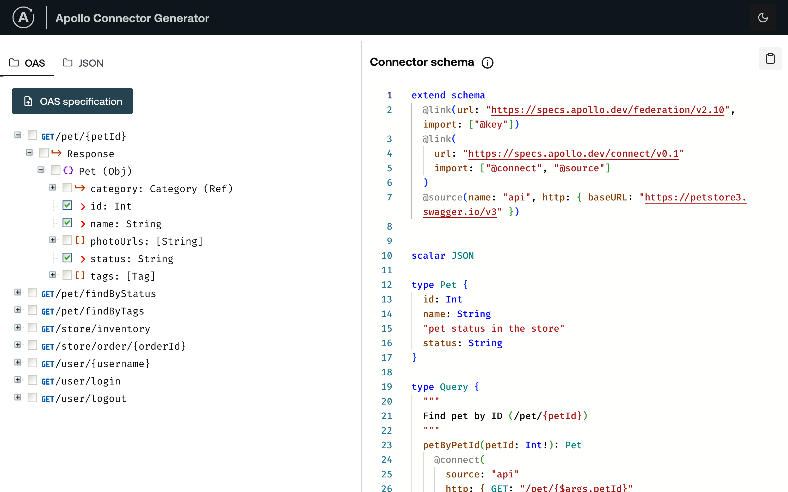

# Apollo Connector Generator

This project provides a user interface for generating Apollo connectors from OpenAPI specifications. It simplifies the process of creating connectors by providing a visual tool to configure and generate the necessary code.

This project the [apollo-conn-gen](https://github.com/fernando-apollo/apollo-conn-gen) library to generate the connector schema. If you are intending to convert specs or JSONs automatically then do check it out.

## Features

- Upload OpenAPI specifications (YAML or JSON), or
- a JSON payload or a folder containing JSON payloads, and
- a JSON editor to paste and edit payloads

### Screenshots

**OAS Spec**


**JSON folder (files are merged)**


## Getting Started

### Prerequisites

- Node.js and npm installed

### Installation

1. Clone the repository:

  ```bash
  git clone [the repo](https://github.com/fernando-apollo/apollo-conn-genui)
  ```

2. Navigate to the project directory:

  ```bash
  cd apollo-conn-genui
  ```

3. Install dependencies:

  ```bash
  npm install
  ```

### Usage

1. Start the development server:

  ```bash
  npm run dev
  ```

2. Open your browser and navigate to `http://localhost:5173` (or the appropriate address).
3. Upload your OpenAPI specification file, or a `JSON` payload or a folder with `JSON` payloads

For OAS specs, navigate the spec tree and choose the fields to use in the connector. The connector schema should be generated (and updated) automatically.

For `JSON` files or folders, the schema will be inferred from the uploaded payload(s). If a folder is uploaded, you can remove any unwanted files and the schema will be updated accordingly.

## Technologies Used

- React
- Node.js

## Limitations

- the OAS parser only works with `GET` requests. Any other methods will be ignored. If you have a spec that contains other verbs such as `POST`, `PUT`, etc. you can still use the `JSON` generator and upload the payloads, as it will still help you accelerate your schema design.

## To-dos

- filter the spec tree by expression
- support `*` selection (select all fields) - the library already supports it
- support `POST`, `PUT`, etc. for OAS specs

## Contributing

Contributions are welcome! Please read the [contributing guidelines](CONTRIBUTING.md) before submitting a pull request.

## License

[MIT](LICENSE)
